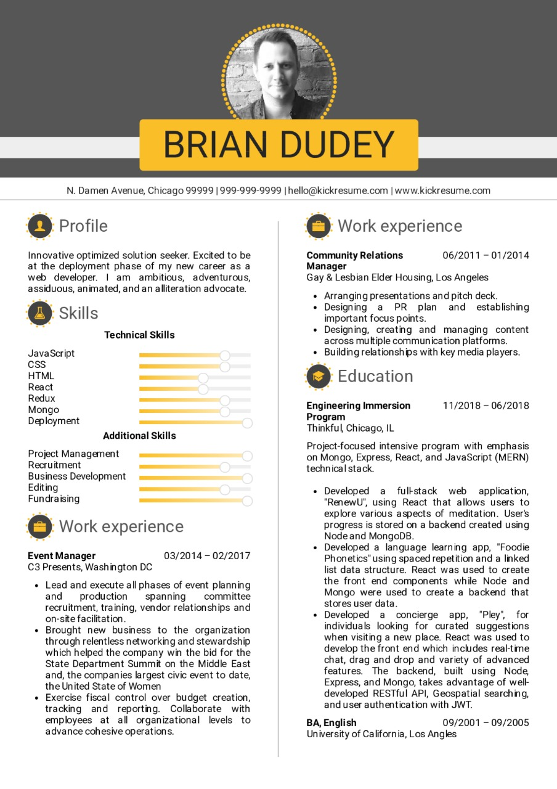

# [Guvi Zen](https://www.guvi.io/zen/)

## HTML Task on RWD.

From the below Title you can pick any two and complete them with responsive design. For your reference visit this URL https://github.com/rvsp/HTML-CSS/tree/master/Tasks

Page Styles I have choose to Practice:

1. https://github.com/rvsp/HTML-CSS/blob/master/Tasks/task-resume.jpeg

